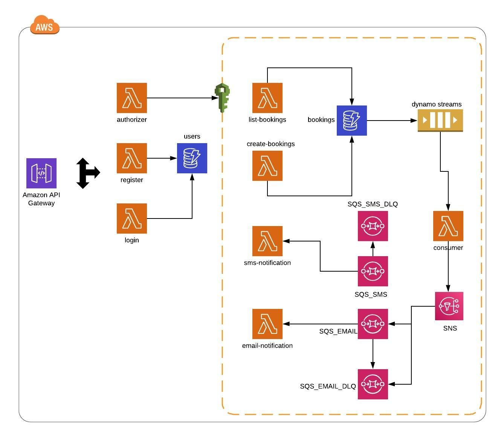

# Cloud Native com Terraform e Serverless Framework





### Introdução

Essa é uma POC criada para demonstrar as vantagens e facilidades ao utilizar o terraform como IaaS e o serverless framework.

## Requisitos 

Antes de executar a POC é necessário que você possua:


- Usuário na AWS com permissão de Administrador
- AWS-CLI instalado e configurado (https://aws.amazon.com/pt/cli/)
- NodeJS 
- NPM 
- Serverless Framework (https://serverless.com/)
- Terraform v.012 ou superior (https://www.terraform.io/)

## 1 - Clonar o repositório

``` 
git clone ssh://git@stash.endurance.com:7999/latamd/cloud-native-terraform-serverless.git
```


## 2 - Caso todos pré-requisitos estejam cumpridos:

Ambiente Dev

```command
bash deploy.sh dev
```

Removendo toda estrutura do ambiente dev:

```super_user
bash destroy.sh
```

Ambiente Prod:

```custom_prefix(mysql>)
bash deploy.sh prod
```

Removendo ambiente Prod: 

```custom_prefix(mysql>)
bash destroy.sh prod
``` 
**A única diferença entre dev e prod é que prod possui mais memória alocada para o lambda**